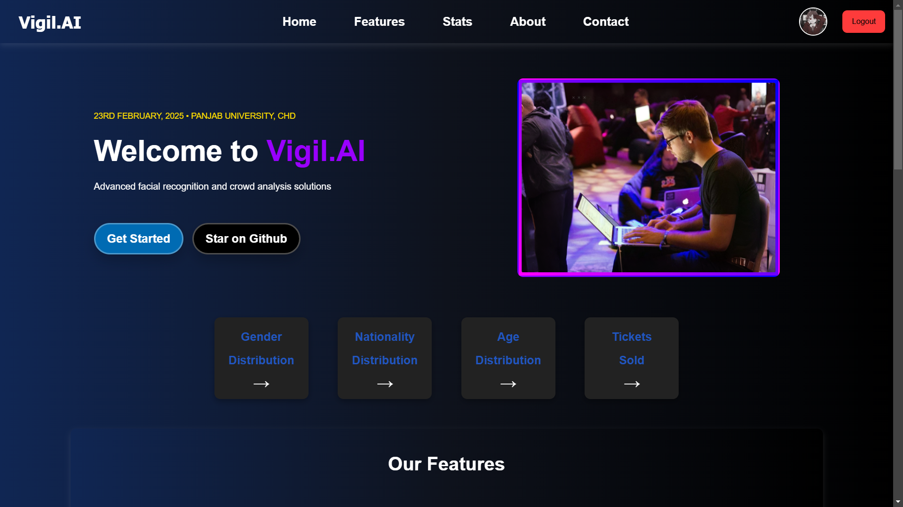
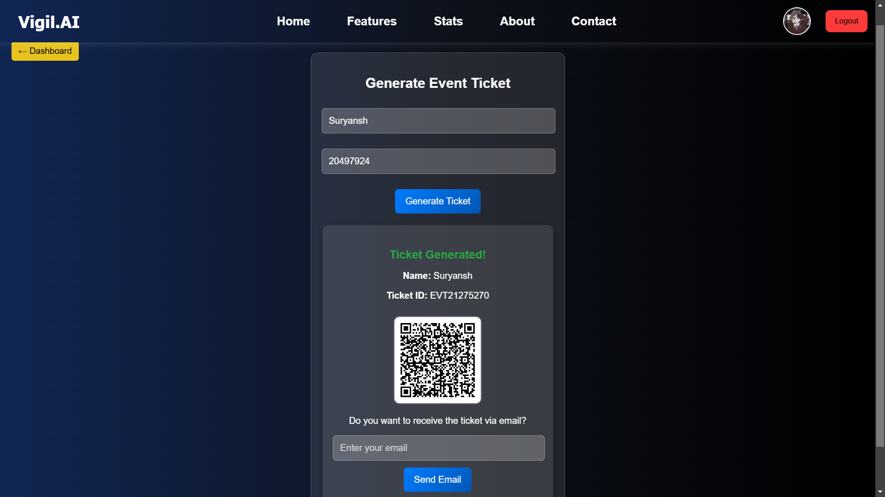
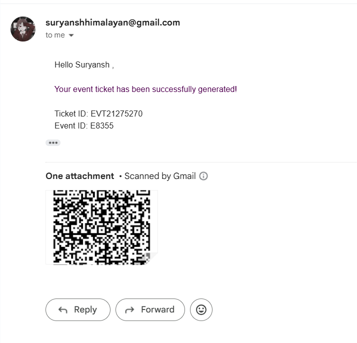
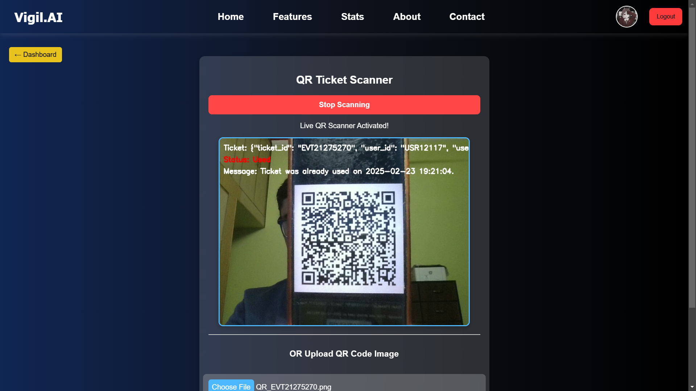
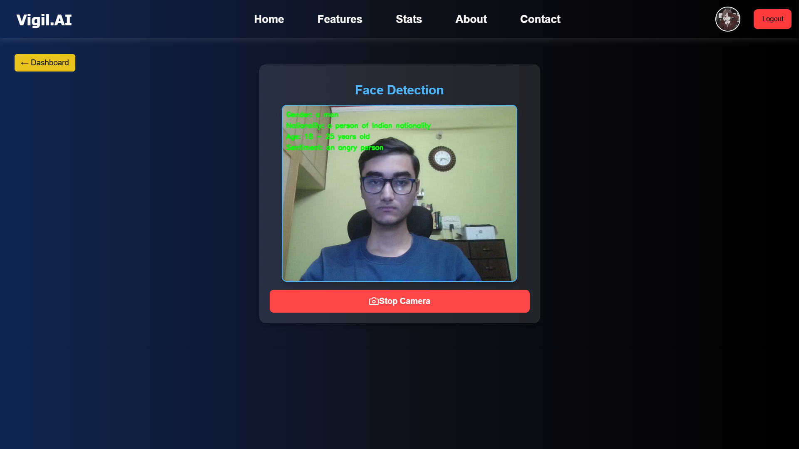
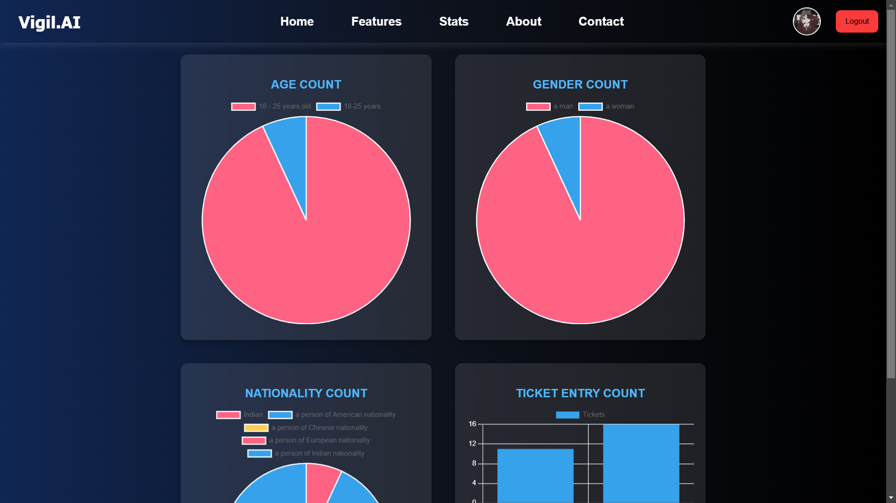
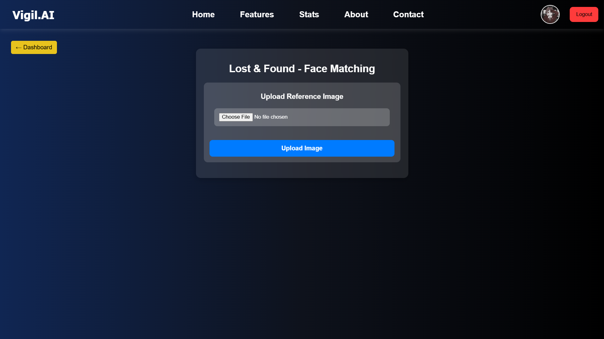
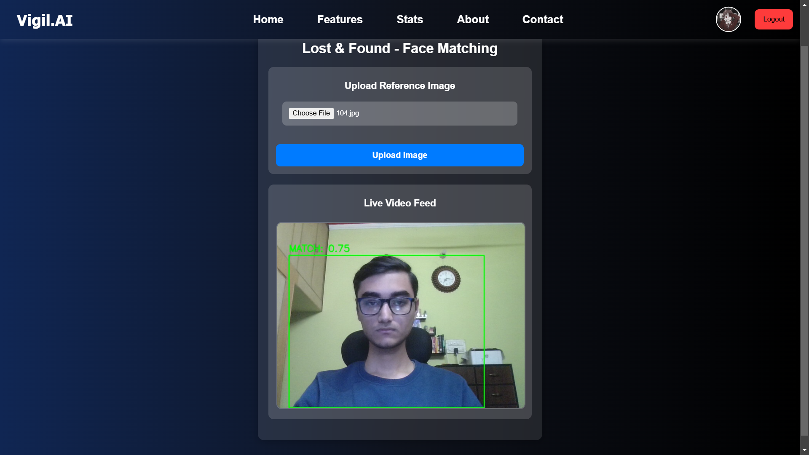
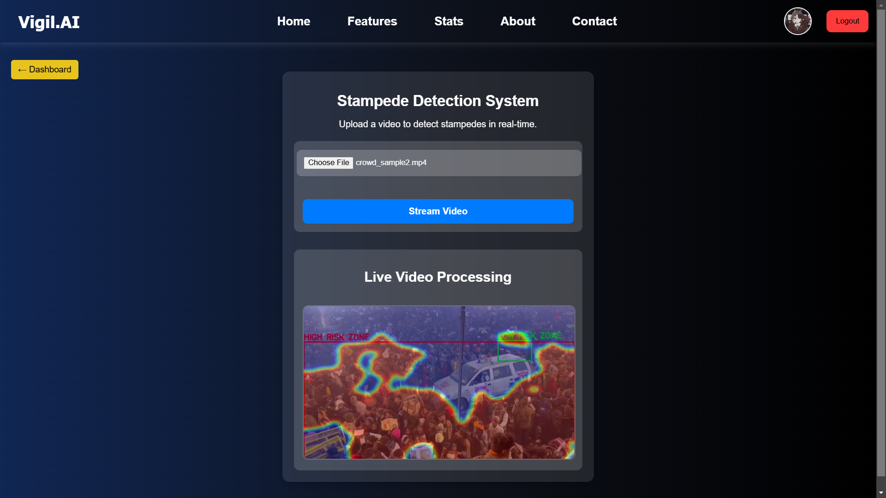
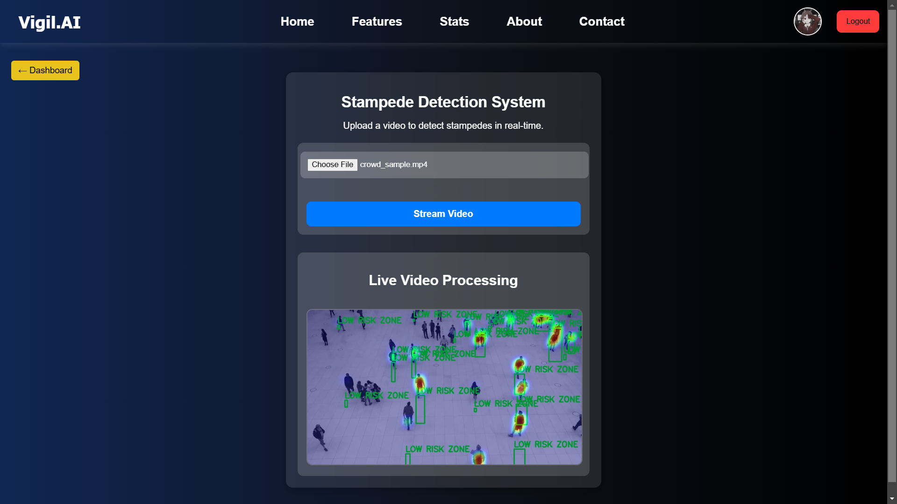

# Vigil.ai: AI Powered Event Management System

Vigil.ai is an AI-powered event management platform designed to enhance security, efficiency, and insights for large-scale events. Our state-of-the-art system incorporates AI-driven ticket authentication, demographic analysis, lost and found services, and crowd safety prediction to ensure a seamless and secure event experience.

<p align="center">
  
</p>

## Table of Contents
- [🎟️ Ticket Authentication](#-ticket-authentication)
- [📊 Demographic Analysis](#-demographic-analysis)
- [🔍 Lost and Found](#-lost-and-found)
- [🚨 Stampede Prediction](#-stampede-prediction)
- [🛠️ Tech Stack](#-tech-stack)
- [📥 Installation](#-installation)
- [🤝 Contributing](#-contributing)
- [📜 License](#-license)


## 🎟️ Ticket Authentication

- Secure ticket generation and validation.<br>
- Tickets are sent directly to users via email.<br>
- Prevents unauthorized access using QR codes and AI-based validation.<br>

<p align="center">
  
</p>

 <p align="center">
  
</p>  <p align="center">
  
</p> 


## 📊 Demographic Analysis

- AI-powered real-time facial analysis.<br>
- Provides insights such as nationality, age range, and gender.<br>
- Helps event organizers understand audience demographics for better planning and marketing.<br>

<p align="center">
  
</p>


   <p align="center">
  


## 🔍 Lost and Found

<p align="center">
  
</p>
- Cutting-edge image recognition to locate lost individuals in a crowd.<br>
- Matches input images against real-time event footage.<br>
- Rapid and accurate person identification using deep learning.<br>

 <p align="center">
  


## 🚨 Stampede Prediction

- AI-based video analysis to predict stampede risks in large crowds.<br>
- Identifies low-risk zones for safe crowd movement.<br>
- Helps organizers take preventive measures and ensure crowd safety.<br>

<p align="center">
  
</p>

<p align="center">
  


## 🛠️ Tech Stack
- **Backend:** Flask, FastAPI, TensorFlow, OpenCV, PyTorch
- **Frontend:** React.js, TailwindCSS
- **Database:** SQLite
- **AI Models:** YOLOv8, CLIP, FaceNet


## 📥 Installation
1. Clone the repository:
   ```sh
   git clone https://github.com/svsaurav95/Vigil.ai.git
   cd Vigil.ai
   ```
2. Install dependencies:
   ```sh
   pip install -r requirements.txt
   ```
3. Set up environment variables:
   ```sh
   cp .env.example .env
   # Update with your credentials
   ```
4. Start the backend server:
   ```sh
   python demographic_db_backend.py
   python nx_LNF_img.py
   python stampede_pred_bck.py
   python gen_ticket_bck.py
   python validate_ticket_bck.py
   python stats_chart.py
   ```
5. Navigate to the frontend directory and run:
   ```sh
   npm install
   npm start
   ```

## 🤝 Contributing
We welcome contributions! Please follow these steps:
1. Fork the repository.
2. Create a feature branch: `git checkout -b feature-name`
3. Commit your changes: `git commit -m "Added new feature"`
4. Push to your branch: `git push origin feature-name`
5. Open a pull request.

## 📜 License
This project is licensed under the MIT License.


**Vigil.ai** - AI-driven event security and management.

